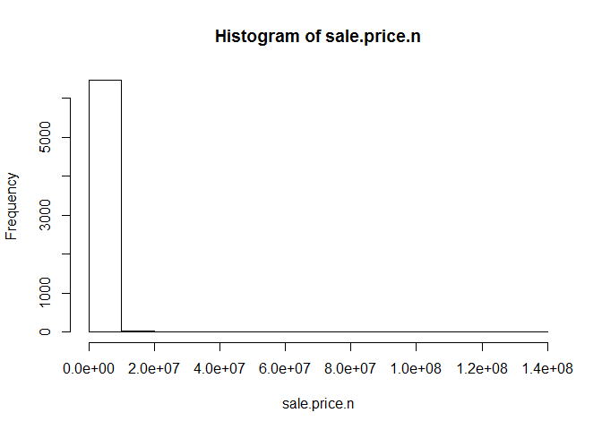

# LiveSessionHW4 Bronx
Vinh Le  
June 1, 2016  

```r
require(gdata)
```

```
## Loading required package: gdata
```

```
## gdata: read.xls support for 'XLS' (Excel 97-2004) files ENABLED.
```

```
## 
```

```
## gdata: read.xls support for 'XLSX' (Excel 2007+) files ENABLED.
```

```
## 
## Attaching package: 'gdata'
```

```
## The following object is masked from 'package:stats':
## 
##     nobs
```

```
## The following object is masked from 'package:utils':
## 
##     object.size
```

```r
require(plyr) #Added by Monnie McGee
```

```
## Loading required package: plyr
```

```r
#install the gdata and plyr packages and load in to R.
library(plyr)
library(gdata)
```


```r
#Mike's configuration
# bk <- read.xls("C:/Users/Mike/OneDrive/Mike/Personal/MSDS/GIT/Bronx/Data/rollingsales_bronx.xls",pattern="BOROUGH",perl="C:/strawberry/perl/bin/perl.exe")


#Mike's configuration
bk <- read.xls("C:/Users/Mike/OneDrive/Mike/Personal/MSDS/GIT/Bronx/Data/rollingsales_bronx.xls",pattern="BOROUGH",perl="C:/strawberry/perl/bin/perl.exe")

# So, save the file as a csv and use read.csv instead
# bk <- read.csv("rollingsales_bronx.csv",skip=4,header=TRUE)
```


```r
## Check the data
head(bk)
```

```
##   BOROUGH              NEIGHBORHOOD
## 1       2 BATHGATE                 
## 2       2 BATHGATE                 
## 3       2 BATHGATE                 
## 4       2 BATHGATE                 
## 5       2 BATHGATE                 
## 6       2 BATHGATE                 
##                        BUILDING.CLASS.CATEGORY TAX.CLASS.AT.PRESENT BLOCK
## 1 01  ONE FAMILY DWELLINGS                                        1  2905
## 2 01  ONE FAMILY DWELLINGS                                        1  2905
## 3 01  ONE FAMILY DWELLINGS                                        1  3035
## 4 01  ONE FAMILY DWELLINGS                                        1  3039
## 5 01  ONE FAMILY DWELLINGS                                        1  3039
## 6 01  ONE FAMILY DWELLINGS                                        1  3053
##   LOT EASE.MENT BUILDING.CLASS.AT.PRESENT
## 1  28        NA                        A9
## 2  28        NA                        A9
## 3   2        NA                        S1
## 4  36        NA                        S1
## 5  36        NA                        S1
## 6  86        NA                        S0
##                                     ADDRESS APARTMENT.NUMBER ZIP.CODE
## 1 1665 WASHINGTON AVENUE                                        10457
## 2 1665 WASHINGTON AVENUE                                        10457
## 3 441 EAST 178 STREET                                           10457
## 4 455 EAST 184 STREET                                           10458
## 5 455 EAST 184 STREET                                           10458
## 6 2364 WASHINGTON AVENUE                                        10458
##   RESIDENTIAL.UNITS COMMERCIAL.UNITS TOTAL.UNITS LAND.SQUARE.FEET
## 1                 1                0           1             4750
## 2                 1                0           1             4750
## 3                 1                1           2             1287
## 4                 1                1           2             2500
## 5                 1                1           2             2500
## 6                 1                2           3             1911
##   GROSS.SQUARE.FEET YEAR.BUILT TAX.CLASS.AT.TIME.OF.SALE
## 1              2619       1899                         1
## 2              2619       1899                         1
## 3              2528       1899                         1
## 4              2452       1910                         1
## 5              2452       1910                         1
## 6              4080       1931                         1
##   BUILDING.CLASS.AT.TIME.OF.SALE SALE.PRICE  SALE.DATE
## 1                             A9        $ 0 2015-08-07
## 2                             A9        $ 0 2015-08-07
## 3                             S1        $ 0 2015-12-18
## 4                             S1        $ 0 2015-08-18
## 5                             S1  $ 400,000 2015-07-01
## 6                             S0        $ 0 2016-03-17
```

```r
summary(bk)
```

```
##     BOROUGH                     NEIGHBORHOOD 
##  Min.   :2   RIVERDALE                : 658  
##  1st Qu.:2   PARKCHESTER              : 403  
##  Median :2   SOUNDVIEW                : 398  
##  Mean   :2   WILLIAMSBRIDGE           : 360  
##  3rd Qu.:2   MORRISANIA/LONGWOOD      : 359  
##  Max.   :2   BAYCHESTER               : 339  
##              (Other)                  :3991  
##                                  BUILDING.CLASS.CATEGORY
##  02  TWO FAMILY DWELLINGS                    :1771      
##  01  ONE FAMILY DWELLINGS                    :1097      
##  10  COOPS - ELEVATOR APARTMENTS             : 958      
##  03  THREE FAMILY DWELLINGS                  : 621      
##  07  RENTALS - WALKUP APARTMENTS             : 577      
##  13  CONDOS - ELEVATOR APARTMENTS            : 333      
##  (Other)                                     :1151      
##  TAX.CLASS.AT.PRESENT     BLOCK           LOT         EASE.MENT     
##  1      :3511         Min.   :2268   Min.   :   1.0   Mode:logical  
##  2      :1785         1st Qu.:3226   1st Qu.:  23.0   NA's:6508     
##  4      : 604         Median :4056   Median :  47.0                 
##  2A     : 247         Mean   :4158   Mean   : 272.8                 
##  1B     : 164         3rd Qu.:5050   3rd Qu.: 118.0                 
##  2B     : 118         Max.   :5953   Max.   :7501.0                 
##  (Other):  79                                                       
##  BUILDING.CLASS.AT.PRESENT
##  D4     : 958             
##  B1     : 846             
##  C0     : 621             
##  B2     : 509             
##  A1     : 427             
##  A5     : 404             
##  (Other):2743             
##                                       ADDRESS         APARTMENT.NUMBER
##  N/A BARRY STREET                         :  16               :6048   
##  2287 JOHNSON AVENUE                      :  11   4B          :  14   
##  640 WEST 237 STREET                      :   9   5F          :  10   
##  2140 HOLLAND AVENUE                      :   6   3E          :   9   
##  2385 BARKER AVENUE                       :   6   4C          :   9   
##  4171 WHITE PLAINS ROAD                   :   6   3A          :   8   
##  (Other)                                  :6454   (Other)     : 410   
##     ZIP.CODE     RESIDENTIAL.UNITS  COMMERCIAL.UNITS   TOTAL.UNITS      
##  Min.   :    0   Min.   :   0.000   Min.   : 0.0000   Min.   :   0.000  
##  1st Qu.:10460   1st Qu.:   0.000   1st Qu.: 0.0000   1st Qu.:   1.000  
##  Median :10463   Median :   1.000   Median : 0.0000   Median :   2.000  
##  Mean   :10461   Mean   :   4.075   Mean   : 0.1996   Mean   :   4.276  
##  3rd Qu.:10469   3rd Qu.:   2.000   3rd Qu.: 0.0000   3rd Qu.:   2.000  
##  Max.   :10803   Max.   :1153.000   Max.   :17.0000   Max.   :1153.000  
##                                                                         
##  LAND.SQUARE.FEET GROSS.SQUARE.FEET   YEAR.BUILT  
##  Min.   :     0   Min.   :      0   Min.   :   0  
##  1st Qu.:  1320   1st Qu.:      0   1st Qu.:1920  
##  Median :  2420   Median :   1888   Median :1931  
##  Mean   :  4366   Mean   :   5825   Mean   :1753  
##  3rd Qu.:  3256   3rd Qu.:   3000   3rd Qu.:1960  
##  Max.   :829300   Max.   :1303935   Max.   :2016  
##                                                   
##  TAX.CLASS.AT.TIME.OF.SALE BUILDING.CLASS.AT.TIME.OF.SALE     SALE.PRICE  
##  Min.   :1.000             D4     : 958                   $ 0      :1652  
##  1st Qu.:1.000             B1     : 845                   $ 10     :  63  
##  Median :1.000             C0     : 621                   $ 400,000:  56  
##  Mean   :1.615             B2     : 509                   $ 450,000:  53  
##  3rd Qu.:2.000             A1     : 429                   $ 300,000:  50  
##  Max.   :4.000             A5     : 404                   $ 350,000:  45  
##                            (Other):2742                   (Other)  :4589  
##       SALE.DATE   
##  2015-10-28:  61  
##  2016-03-01:  59  
##  2015-09-09:  58  
##  2015-12-22:  58  
##  2015-05-04:  54  
##  2015-10-14:  53  
##  (Other)   :6165
```

```r
str(bk) # Very handy function!
```

```
## 'data.frame':	6508 obs. of  21 variables:
##  $ BOROUGH                       : int  2 2 2 2 2 2 2 2 2 2 ...
##  $ NEIGHBORHOOD                  : Factor w/ 38 levels "BATHGATE                 ",..: 1 1 1 1 1 1 1 1 1 1 ...
##  $ BUILDING.CLASS.CATEGORY       : Factor w/ 36 levels "01  ONE FAMILY DWELLINGS                    ",..: 1 1 1 1 1 1 1 2 2 2 ...
##  $ TAX.CLASS.AT.PRESENT          : Factor w/ 10 levels "1","1A","1B",..: 1 1 1 1 1 1 1 1 1 1 ...
##  $ BLOCK                         : int  2905 2905 3035 3039 3039 3053 3053 2900 2912 2912 ...
##  $ LOT                           : int  28 28 2 36 36 86 102 61 117 118 ...
##  $ EASE.MENT                     : logi  NA NA NA NA NA NA ...
##  $ BUILDING.CLASS.AT.PRESENT     : Factor w/ 107 levels "A0","A1","A2",..: 9 9 89 89 89 88 2 90 10 10 ...
##  $ ADDRESS                       : Factor w/ 5930 levels "1 ANGELAS PLACE                          ",..: 1321 1321 4278 4368 4368 2332 2293 4027 1115 1119 ...
##  $ APARTMENT.NUMBER              : Factor w/ 204 levels "            ",..: 1 1 1 1 1 1 1 1 1 1 ...
##  $ ZIP.CODE                      : int  10457 10457 10457 10458 10458 10458 10458 10457 10457 10457 ...
##  $ RESIDENTIAL.UNITS             : int  1 1 1 1 1 1 1 2 2 2 ...
##  $ COMMERCIAL.UNITS              : int  0 0 1 1 1 2 0 1 0 0 ...
##  $ TOTAL.UNITS                   : int  1 1 2 2 2 3 1 3 2 2 ...
##  $ LAND.SQUARE.FEET              : int  4750 4750 1287 2500 2500 1911 919 1855 2000 2000 ...
##  $ GROSS.SQUARE.FEET             : int  2619 2619 2528 2452 2452 4080 1248 4452 2400 2400 ...
##  $ YEAR.BUILT                    : int  1899 1899 1899 1910 1910 1931 1901 1931 1993 1993 ...
##  $ TAX.CLASS.AT.TIME.OF.SALE     : int  1 1 1 1 1 1 1 1 1 1 ...
##  $ BUILDING.CLASS.AT.TIME.OF.SALE: Factor w/ 108 levels "A0","A1","A2",..: 9 9 90 90 90 89 2 91 10 10 ...
##  $ SALE.PRICE                    : Factor w/ 1554 levels "$ 0","$ 1","$ 1,000",..: 1 1 1 1 902 1 1 868 1073 1 ...
##  $ SALE.DATE                     : Factor w/ 300 levels "2015-05-01","2015-05-04",..: 80 80 189 88 51 264 215 245 287 184 ...
```


```r
## clean/format the data with regular expressions
## More on these later. For now, know that the
## pattern "[^[:digit:]]" refers to members of the variable name that
## start with digits. We use the gsub command to replace them with a blank space.
# We create a new variable that is a "clean' version of sale.price.
# And sale.price.n is numeric, not a factor.
bk$SALE.PRICE.N <- as.numeric(gsub("[^[:digit:]]","", bk$SALE.PRICE))
count(is.na(bk$SALE.PRICE.N))
```

```
##       x freq
## 1 FALSE 6508
```


```r
names(bk) <- tolower(names(bk)) # make all variable names lower case
## Get rid of leading digits
bk$gross.sqft <- as.numeric(gsub("[^[:digit:]]","", bk$gross.square.feet))
bk$land.sqft <- as.numeric(gsub("[^[:digit:]]","", bk$land.square.feet))
bk$year.built <- as.numeric(as.character(bk$year.built))
```


```r
## do a bit of exploration to make sure there's not anything
## weird going on with sale prices
attach(bk)
hist(sale.price.n) 
```

<!-- -->

```r
detach(bk)
```


```r
## keep only the actual sales

bk.sale <- bk[bk$sale.price.n!=0,]
plot(bk.sale$gross.sqft,bk.sale$sale.price.n)
```

<!-- -->

```r
plot(log10(bk.sale$gross.sqft),log10(bk.sale$sale.price.n))
```

<!-- -->


```r
## for now, let's look at 1-, 2-, and 3-family homes
bk.homes <- bk.sale[which(grepl("FAMILY",bk.sale$building.class.category)),]
dim(bk.homes)
```

```
## [1] 2589   24
```

```r
plot(log10(bk.homes$gross.sqft),log10(bk.homes$sale.price.n))
```

<!-- -->

```r
summary(bk.homes[which(bk.homes$sale.price.n<100000),])
```

```
##     borough                     neighborhood
##  Min.   :2   BAYCHESTER               :14   
##  1st Qu.:2   MORRISANIA/LONGWOOD      :12   
##  Median :2   SOUNDVIEW                :12   
##  Mean   :2   WAKEFIELD                : 8   
##  3rd Qu.:2   BRONXDALE                : 7   
##  Max.   :2   THROGS NECK              : 7   
##              (Other)                  :68   
##                                  building.class.category
##  02  TWO FAMILY DWELLINGS                    :62        
##  01  ONE FAMILY DWELLINGS                    :42        
##  03  THREE FAMILY DWELLINGS                  :24        
##  04  TAX CLASS 1 CONDOS                      : 0        
##  05  TAX CLASS 1 VACANT LAND                 : 0        
##  06  TAX CLASS 1 - OTHER                     : 0        
##  (Other)                                     : 0        
##  tax.class.at.present     block           lot          ease.ment     
##  1      :128          Min.   :2278   Min.   :   1.00   Mode:logical  
##  1A     :  0          1st Qu.:3226   1st Qu.:  20.75   NA's:128      
##  1B     :  0          Median :4072   Median :  46.00                 
##  1D     :  0          Mean   :4113   Mean   :  92.44                 
##  2      :  0          3rd Qu.:4980   3rd Qu.:  82.50                 
##  2A     :  0          Max.   :5870   Max.   :2294.00                 
##  (Other):  0                                                         
##  building.class.at.present                                      address   
##  B1     :30                1281 UNION AVE                           :  4  
##  C0     :24                1774 CROSS BRONX EXPRESSW                :  2  
##  A1     :19                3230 JOHNSON AVENUE                      :  2  
##  B2     :14                4465 PARK AVE                            :  2  
##  B3     :13                1010 QUINCY AVENUE                       :  1  
##  A5     : 8                1041 EAST 223 STREET                     :  1  
##  (Other):20                (Other)                                  :116  
##      apartment.number    zip.code     residential.units commercial.units 
##              :128     Min.   :10453   Min.   :1.000     Min.   :0.00000  
##  1           :  0     1st Qu.:10459   1st Qu.:1.000     1st Qu.:0.00000  
##  1-Jan       :  0     Median :10465   Median :2.000     Median :0.00000  
##  1-Mar       :  0     Mean   :10464   Mean   :1.859     Mean   :0.03125  
##  1-Nov       :  0     3rd Qu.:10469   3rd Qu.:2.000     3rd Qu.:0.00000  
##  1-Sep       :  0     Max.   :10475   Max.   :3.000     Max.   :1.00000  
##  (Other)     :  0                                                        
##   total.units    land.square.feet gross.square.feet   year.built  
##  Min.   :1.000   Min.   :  297    Min.   : 458      Min.   :1800  
##  1st Qu.:1.000   1st Qu.: 1939    1st Qu.:1479      1st Qu.:1910  
##  Median :2.000   Median : 2500    Median :2150      Median :1928  
##  Mean   :1.891   Mean   : 2651    Mean   :2137      Mean   :1933  
##  3rd Qu.:2.000   3rd Qu.: 2889    3rd Qu.:2709      3rd Qu.:1950  
##  Max.   :3.000   Max.   :10690    Max.   :4320      Max.   :2012  
##                                                                   
##  tax.class.at.time.of.sale building.class.at.time.of.sale    sale.price
##  Min.   :1                 B1     :30                     $ 10    :47  
##  1st Qu.:1                 C0     :24                     $ 100   :10  
##  Median :1                 A1     :19                     $ 1     : 7  
##  Mean   :1                 B2     :14                     $ 1,000 : 5  
##  3rd Qu.:1                 B3     :13                     $ 500   : 5  
##  Max.   :1                 A5     : 8                     $ 50,000: 4  
##                            (Other):20                     (Other) :50  
##       sale.date    sale.price.n     gross.sqft     land.sqft    
##  2015-09-01:  4   Min.   :    1   Min.   : 458   Min.   :  297  
##  2015-12-11:  4   1st Qu.:   10   1st Qu.:1479   1st Qu.: 1939  
##  2015-05-08:  3   Median :  300   Median :2150   Median : 2500  
##  2015-07-22:  3   Mean   :19036   Mean   :2137   Mean   : 2651  
##  2015-10-30:  3   3rd Qu.:30000   3rd Qu.:2709   3rd Qu.: 2889  
##  2015-05-15:  2   Max.   :97000   Max.   :4320   Max.   :10690  
##  (Other)   :109
```


```r
## remove outliers that seem like they weren't actual sales
bk.homes$outliers <- (log10(bk.homes$sale.price.n) <=5) + 0
bk.homes <- bk.homes[which(bk.homes$outliers==0),]
plot(log(bk.homes$gross.sqft),log(bk.homes$sale.price.n))
```

<!-- -->

```r
##Histogram of square footage after log transformation
hist(log(bk.homes$gross.sqft))
```

<!-- -->

```r
##Histogram of sale price after log transformation
hist(log(bk.homes$sale.price.n))
```

<!-- -->
