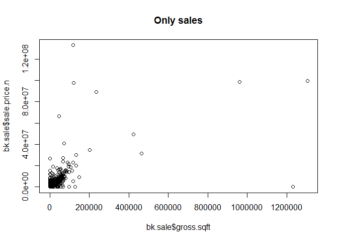
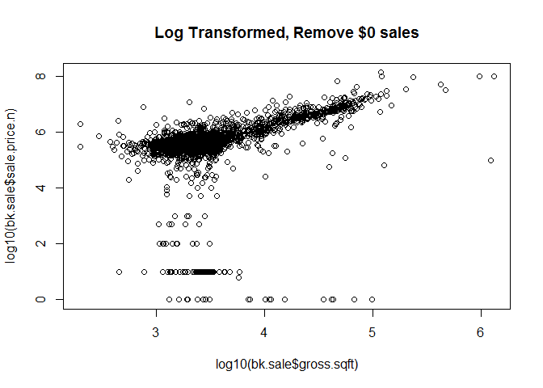
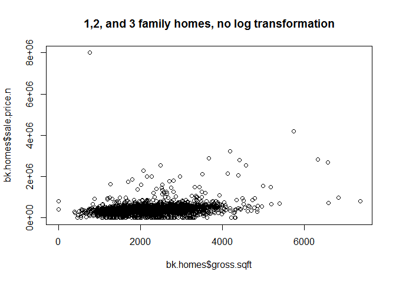
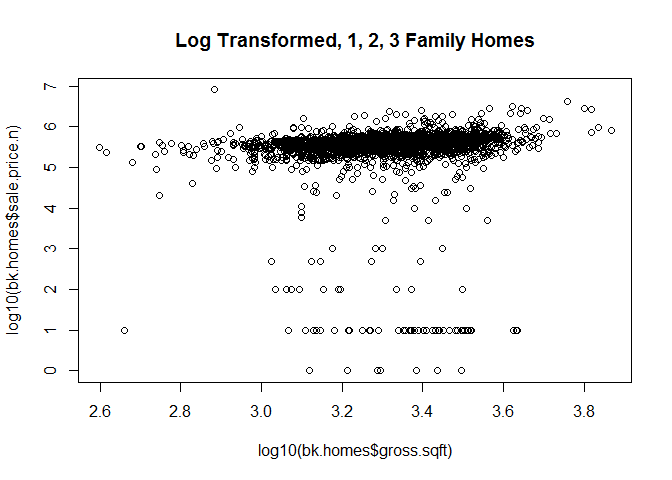
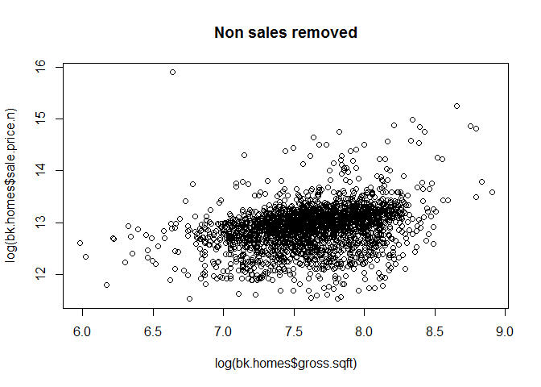
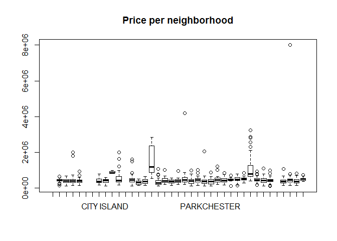
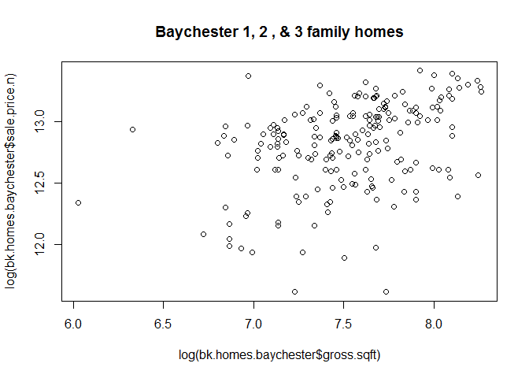
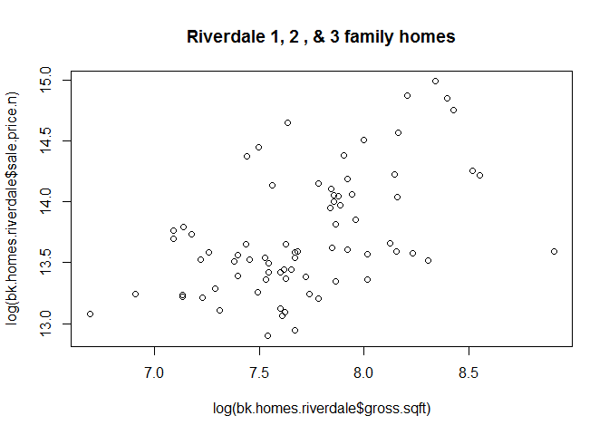
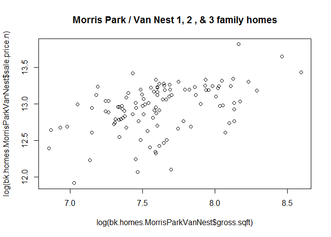

# Live Session Unit 4 - 403
Armand Post, Mike Martos, Vin Le, Rajeev Kumar  
June 4, 2016  


### Set working directory and load packages

```r
##require(gdata)
require(plyr) 
```

```
## Loading required package: plyr
```

```r
#install the gdata and plyr packages and load in to R.
library(plyr)
```


### Load the datafile

```r
bk <- read.csv("../Data/rollingsales_bronx.csv",skip=4,header=TRUE)
```

###  Make all variable names lower case

```r
names(bk) <- tolower(names(bk)) 
```

### Clean and format the data, removing non-numeric characters.

```r
bk$sale.price.n <- as.numeric(gsub("[^[:digit:]]","", bk$sale.price))
bk$gross.sqft <- as.numeric(gsub("[^[:digit:]]","", bk$gross.square.feet))
bk$land.sqft <- as.numeric(gsub("[^[:digit:]]","", bk$land.square.feet))
count(is.na(bk$SALE.PRICE.N))
```

```
## Warning in is.na(bk$SALE.PRICE.N): is.na() applied to non-(list or vector)
## of type 'NULL'
```

```
## [1] x    freq
## <0 rows> (or 0-length row.names)
```

```r
bk$year.built <- as.numeric(as.character(bk$year.built))
```

### Below we see the data plotted with $0 sales amounts removed with gross square footage by sales price.

```r
## keep only the actual sales
bk.sale <- bk[bk$sale.price.n!=0,]
plot(bk.sale$gross.sqft,bk.sale$sale.price.n,main="Only sales")
```

<!-- -->

### Since the data appeared clustered above, we log transform the data and assess.

```r
plot(log10(bk.sale$gross.sqft),log10(bk.sale$sale.price.n),main="Log Transformed, Remove $0 sales")
```

<!-- -->


### From the above we can conclude that sales price is positively correlated with gross square footage.


```r
## Next, we Isolate to 1, 2, and 3 family homes.
bk.homes <- bk.sale[which(grepl("FAMILY",bk.sale$building.class.category)),]
```

### Below we see the data plotted with 1, 2, and 3 family homes plotted as gross square footage by sales price.

```r
plot(bk.homes$gross.sqft,bk.homes$sale.price.n,main="1,2, and 3 family homes, no log transformation")
```

<!-- -->

### Since the data appeared clustered above, we log transform the data and assess.


```r
plot(log10(bk.homes$gross.sqft),log10(bk.homes$sale.price.n),main="Log Transformed, 1, 2, 3 Family Homes")
```

<!-- -->


### Since there appear to be a number of outliers, we remove outliers (values below log10 5)

```r
## remove outliers that seem like they weren't actual sales
bk.homes$outliers <- (log10(bk.homes$sale.price.n) <=5) + 0
bk.homes <- bk.homes[which(bk.homes$outliers==0),]
plot(log(bk.homes$gross.sqft),log(bk.homes$sale.price.n),main="Non sales removed")
```

<!-- -->


### Since the data seems to not have a large positive correlation, we assume that neighborhood location of homes affects prices more than sq ft.

```r
boxplot(sale.price.n~neighborhood,data=bk.homes, main="Price per neighborhood")
```

<!-- -->


### However since the number of neighborhoods is large, data would become thin and difficult to assess.

### Below we assess three neighborhoods (Baychester, Riverdale, Morris Park / Van Nest) and and can more clearly see a positive relationship between home prices and sq ft.

```r
## for now, let's look at 1-, 2-, and 3-family homes at BAYCHESTER                                         
bk.homes.baychester <- bk.homes[which(grepl("BAYCHESTER",bk.homes$neighborhood)),]

plot(log(bk.homes.baychester$gross.sqft), log(bk.homes.baychester$sale.price.n),main="Baychester 1, 2 , & 3 family homes")
```

<!-- -->

For home properties at BAYCHESTER, price of majority of properties increases with increase in their size. However, there are many properties, where prices either remain flat or decreased with increase in size.


```r
## for now, let's look at 1-, 2-, and 3-family homes at RIVERDALE                                         
bk.homes.riverdale <- bk.homes[which(grepl("RIVERDALE",bk.homes$neighborhood)),]

plot(log(bk.homes.riverdale$gross.sqft), log(bk.homes.riverdale$sale.price.n),main="Riverdale 1, 2 , & 3 family homes")
```

<!-- -->

For home properties at RIVERDALE, price of majority of properties increases with increase in their size. However, there are many properties, where prices either remain flat or decreased with increase in size.

```r
## for now, let's look at 1-, 2-, and 3-family homes at MORRIS PARK/VAN NEST                                         
bk.homes.MorrisParkVanNest <- bk.homes[which(grepl("MORRIS PARK/VAN NEST",bk.homes$neighborhood)),]

plot(log(bk.homes.MorrisParkVanNest$gross.sqft), log(bk.homes.MorrisParkVanNest$sale.price.n),main="Morris Park / Van Nest 1, 2 , & 3 family homes")
```

<!-- -->

For home properties at MORRIS PARK/VAN NEST, price of majority of properties increases with increase in their size. However, there are many properties, where prices either remain flat or decreased with increase in size.
