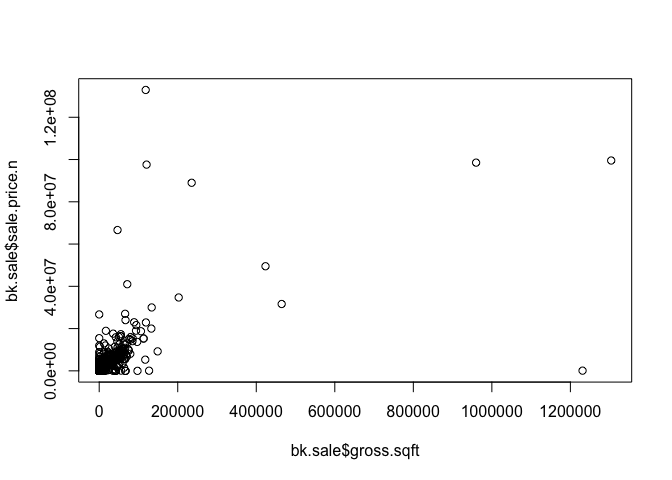
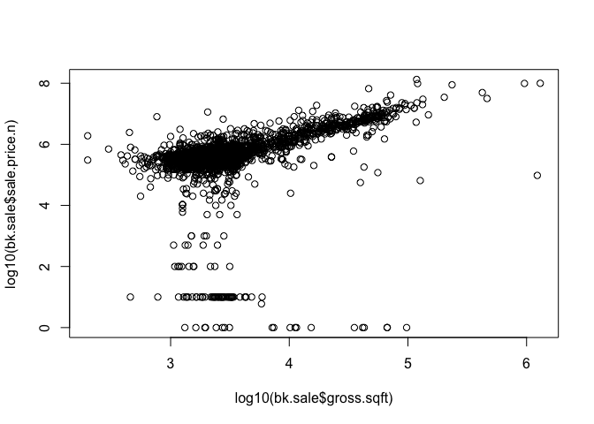
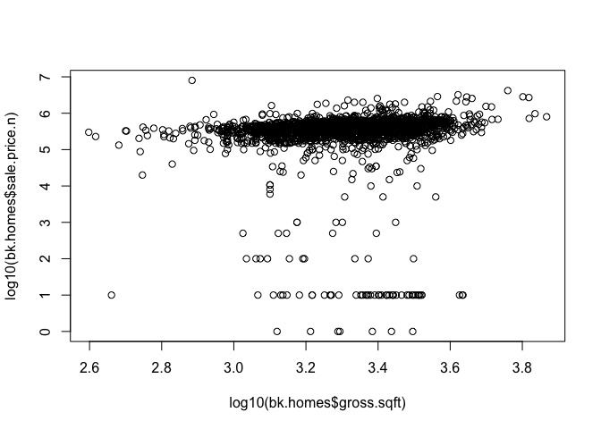
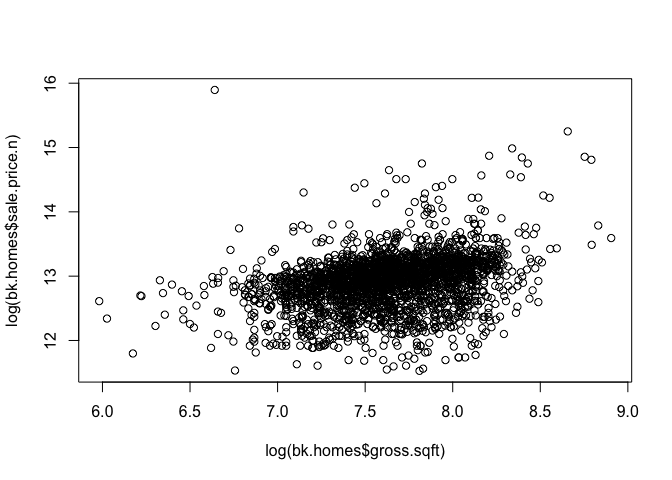
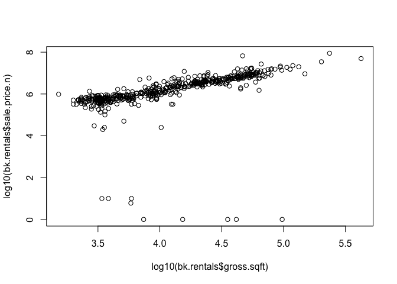
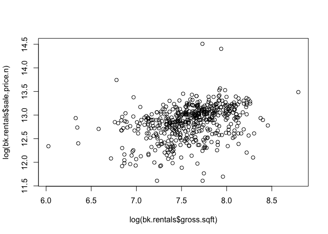

# GraphsPlots
Rajeev  
June 4, 2016  


```r
require(gdata)
```

```
## Loading required package: gdata
```

```
## gdata: read.xls support for 'XLS' (Excel 97-2004) files ENABLED.
```

```
## 
```

```
## gdata: read.xls support for 'XLSX' (Excel 2007+) files ENABLED.
```

```
## 
## Attaching package: 'gdata'
```

```
## The following object is masked from 'package:stats':
## 
##     nobs
```

```
## The following object is masked from 'package:utils':
## 
##     object.size
```

```
## The following object is masked from 'package:base':
## 
##     startsWith
```

```r
require(plyr) #Added by Monnie McGee
```

```
## Loading required package: plyr
```

```r
#install the gdata and plyr packages and load in to R.
library(plyr)
library(gdata)
```


```r
setwd("../Paper")
#setwd("/Users/rajeevkumar/GitHub/LiveSessionHomeWork4Bronx/Data")
## You need a perl interpreter to do this on Windows.
## It's automatic in Mac
bk <- read.xls("../Data/rollingsales_bronx.xls",pattern="BOROUGH")
# So, save the file as a csv and use read.csv instead
# bk <- read.csv("rollingsales_bronx.csv",skip=4,header=TRUE)
```


```r
## clean/format the data with regular expressions
# We create a new variable that is a "clean' version of sale.price.
bk$SALE.PRICE.N <- as.numeric(gsub("[^[:digit:]]","", bk$SALE.PRICE))
count(is.na(bk$SALE.PRICE.N))
```

```
##       x freq
## 1 FALSE 6508
```


```r
names(bk) <- tolower(names(bk)) # make all variable names lower case
## Get rid of leading digits
bk$gross.sqft <- as.numeric(gsub("[^[:digit:]]","", bk$gross.square.feet))
bk$land.sqft <- as.numeric(gsub("[^[:digit:]]","", bk$land.square.feet))
bk$year.built <- as.numeric(as.character(bk$year.built))
```


```r
## keep only the actual sales
bk.sale <- bk[bk$sale.price.n!=0,]
plot(bk.sale$gross.sqft,bk.sale$sale.price.n)
```

<!-- -->

```r
## Beacuse of wide range of price and size, it is not possible to get any trend or conclusion from above graph.
plot(log10(bk.sale$gross.sqft),log10(bk.sale$sale.price.n))
```

<!-- -->

```r
## As per this graphs, price of most of properties increases with increase in area.
```


```r
## for now, let's look at 1-, 2-, and 3-family homes
bk.homes <- bk.sale[which(grepl("FAMILY",bk.sale$building.class.category)),]
dim(bk.homes)
```

```
## [1] 2589   24
```

```r
plot(log10(bk.homes$gross.sqft),log10(bk.homes$sale.price.n))
```

<!-- -->

```r
#From above graph, one can conclude that prices remain flat with increase in size. However, there are many sales which doesn't look like actual sales.

summary(bk.homes[which(bk.homes$sale.price.n<100000),])
```

```
##     borough                     neighborhood
##  Min.   :2   BAYCHESTER               :14   
##  1st Qu.:2   MORRISANIA/LONGWOOD      :12   
##  Median :2   SOUNDVIEW                :12   
##  Mean   :2   WAKEFIELD                : 8   
##  3rd Qu.:2   BRONXDALE                : 7   
##  Max.   :2   THROGS NECK              : 7   
##              (Other)                  :68   
##                                  building.class.category
##  02  TWO FAMILY DWELLINGS                    :62        
##  01  ONE FAMILY DWELLINGS                    :42        
##  03  THREE FAMILY DWELLINGS                  :24        
##  04  TAX CLASS 1 CONDOS                      : 0        
##  05  TAX CLASS 1 VACANT LAND                 : 0        
##  06  TAX CLASS 1 - OTHER                     : 0        
##  (Other)                                     : 0        
##  tax.class.at.present     block           lot          ease.ment     
##  1      :128          Min.   :2278   Min.   :   1.00   Mode:logical  
##  1A     :  0          1st Qu.:3226   1st Qu.:  20.75   NA's:128      
##  1B     :  0          Median :4072   Median :  46.00                 
##  1D     :  0          Mean   :4113   Mean   :  92.44                 
##  2      :  0          3rd Qu.:4980   3rd Qu.:  82.50                 
##  2A     :  0          Max.   :5870   Max.   :2294.00                 
##  (Other):  0                                                         
##  building.class.at.present                                      address   
##  B1     :30                1281 UNION AVE                           :  4  
##  C0     :24                1774 CROSS BRONX EXPRESSW                :  2  
##  A1     :19                3230 JOHNSON AVENUE                      :  2  
##  B2     :14                4465 PARK AVE                            :  2  
##  B3     :13                1010 QUINCY AVENUE                       :  1  
##  A5     : 8                1041 EAST 223 STREET                     :  1  
##  (Other):20                (Other)                                  :116  
##      apartment.number    zip.code     residential.units commercial.units 
##              :128     Min.   :10453   Min.   :1.000     Min.   :0.00000  
##  1           :  0     1st Qu.:10459   1st Qu.:1.000     1st Qu.:0.00000  
##  1-Jan       :  0     Median :10465   Median :2.000     Median :0.00000  
##  1-Mar       :  0     Mean   :10464   Mean   :1.859     Mean   :0.03125  
##  1-Nov       :  0     3rd Qu.:10469   3rd Qu.:2.000     3rd Qu.:0.00000  
##  1-Sep       :  0     Max.   :10475   Max.   :3.000     Max.   :1.00000  
##  (Other)     :  0                                                        
##   total.units    land.square.feet gross.square.feet   year.built  
##  Min.   :1.000   Min.   :  297    Min.   : 458      Min.   :1800  
##  1st Qu.:1.000   1st Qu.: 1939    1st Qu.:1479      1st Qu.:1910  
##  Median :2.000   Median : 2500    Median :2150      Median :1928  
##  Mean   :1.891   Mean   : 2651    Mean   :2137      Mean   :1933  
##  3rd Qu.:2.000   3rd Qu.: 2889    3rd Qu.:2709      3rd Qu.:1950  
##  Max.   :3.000   Max.   :10690    Max.   :4320      Max.   :2012  
##                                                                   
##  tax.class.at.time.of.sale building.class.at.time.of.sale    sale.price
##  Min.   :1                 B1     :30                     $ 10    :47  
##  1st Qu.:1                 C0     :24                     $ 100   :10  
##  Median :1                 A1     :19                     $ 1     : 7  
##  Mean   :1                 B2     :14                     $ 1,000 : 5  
##  3rd Qu.:1                 B3     :13                     $ 500   : 5  
##  Max.   :1                 A5     : 8                     $ 50,000: 4  
##                            (Other):20                     (Other) :50  
##       sale.date    sale.price.n     gross.sqft     land.sqft    
##  2015-09-01:  4   Min.   :    1   Min.   : 458   Min.   :  297  
##  2015-12-11:  4   1st Qu.:   10   1st Qu.:1479   1st Qu.: 1939  
##  2015-05-08:  3   Median :  300   Median :2150   Median : 2500  
##  2015-07-22:  3   Mean   :19036   Mean   :2137   Mean   : 2651  
##  2015-10-30:  3   3rd Qu.:30000   3rd Qu.:2709   3rd Qu.: 2889  
##  2015-05-15:  2   Max.   :97000   Max.   :4320   Max.   :10690  
##  (Other)   :109
```


```r
## remove outliers that seem like they weren't actual sales
bk.homes$outliers <- (log10(bk.homes$sale.price.n) <=5) + 0
bk.homes <- bk.homes[which(bk.homes$outliers==0),]
plot(log(bk.homes$gross.sqft),log(bk.homes$sale.price.n))
```

<!-- -->

```r
## For home properties , price of majority of properties increases with increase in their size. However, there are many properties, where prices either remain flat or decreased with increase in size.
summary(bk.homes[which(bk.homes$sale.price.n>=100000),])
```

```
##     borough                     neighborhood 
##  Min.   :2   BAYCHESTER               : 209  
##  1st Qu.:2   WILLIAMSBRIDGE           : 202  
##  Median :2   THROGS NECK              : 175  
##  Mean   :2   SOUNDVIEW                : 167  
##  3rd Qu.:2   MORRISANIA/LONGWOOD      : 137  
##  Max.   :2   WAKEFIELD                : 136  
##              (Other)                  :1427  
##                                  building.class.category
##  02  TWO FAMILY DWELLINGS                    :1233      
##  01  ONE FAMILY DWELLINGS                    : 812      
##  03  THREE FAMILY DWELLINGS                  : 408      
##  04  TAX CLASS 1 CONDOS                      :   0      
##  05  TAX CLASS 1 VACANT LAND                 :   0      
##  06  TAX CLASS 1 - OTHER                     :   0      
##  (Other)                                     :   0      
##  tax.class.at.present     block           lot          ease.ment     
##  1      :2450         Min.   :2278   Min.   :   1.00   Mode:logical  
##  1B     :   2         1st Qu.:3436   1st Qu.:  22.00   NA's:2453     
##  1D     :   1         Median :4456   Median :  44.00                 
##  1A     :   0         Mean   :4278   Mean   :  91.58                 
##  2      :   0         3rd Qu.:5027   3rd Qu.:  77.00                 
##  2A     :   0         Max.   :5953   Max.   :4336.00                 
##  (Other):   0                                                        
##  building.class.at.present
##  B1     :561              
##  C0     :408              
##  B2     :372              
##  A5     :312              
##  A1     :309              
##  B3     :192              
##  (Other):299              
##                                       address         apartment.number
##  2272 HAMPDEN PLACE                       :   3               :2453   
##  1001 EAST 241 STREET                     :   2   1           :   0   
##  1016 EAST 223 STREET                     :   2   1-Jan       :   0   
##  1019A EAST 229 STREET                    :   2   1-Mar       :   0   
##  1024 WARD AVENUE                         :   2   1-Nov       :   0   
##  1034 ELDER AVENUE                        :   2   1-Sep       :   0   
##  (Other)                                  :2440   (Other)     :   0   
##     zip.code     residential.units commercial.units   total.units    
##  Min.   :10451   Min.   : 1.000    Min.   :0.00000   Min.   : 1.000  
##  1st Qu.:10461   1st Qu.: 1.000    1st Qu.:0.00000   1st Qu.: 1.000  
##  Median :10465   Median : 2.000    Median :0.00000   Median : 2.000  
##  Mean   :10465   Mean   : 1.858    Mean   :0.02079   Mean   : 1.879  
##  3rd Qu.:10469   3rd Qu.: 2.000    3rd Qu.:0.00000   3rd Qu.: 2.000  
##  Max.   :10803   Max.   :57.000    Max.   :1.00000   Max.   :57.000  
##                                                                      
##  land.square.feet gross.square.feet   year.built  
##  Min.   :   650   Min.   :   0      Min.   :1898  
##  1st Qu.:  2000   1st Qu.:1606      1st Qu.:1920  
##  Median :  2500   Median :2050      Median :1931  
##  Mean   :  2929   Mean   :2183      Mean   :1941  
##  3rd Qu.:  2900   3rd Qu.:2680      3rd Qu.:1960  
##  Max.   :163800   Max.   :7368      Max.   :2015  
##                                                   
##  tax.class.at.time.of.sale building.class.at.time.of.sale     sale.price  
##  Min.   :1                 B1     :562                    $ 400,000:  47  
##  1st Qu.:1                 C0     :408                    $ 300,000:  40  
##  Median :1                 B2     :372                    $ 450,000:  39  
##  Mean   :1                 A5     :313                    $ 350,000:  37  
##  3rd Qu.:1                 A1     :310                    $ 500,000:  35  
##  Max.   :1                 B3     :193                    $ 460,000:  33  
##                            (Other):295                    (Other)  :2222  
##       sale.date     sale.price.n       gross.sqft     land.sqft     
##  2016-02-29:  21   Min.   : 101500   Min.   :   0   Min.   :   650  
##  2015-12-18:  20   1st Qu.: 320000   1st Qu.:1606   1st Qu.:  2000  
##  2015-08-31:  19   Median : 418700   Median :2050   Median :  2500  
##  2015-11-12:  19   Mean   : 445979   Mean   :2183   Mean   :  2929  
##  2016-02-26:  19   3rd Qu.: 510000   3rd Qu.:2680   3rd Qu.:  2900  
##  2015-05-15:  18   Max.   :8000000   Max.   :7368   Max.   :163800  
##  (Other)   :2337                                                    
##     outliers
##  Min.   :0  
##  1st Qu.:0  
##  Median :0  
##  Mean   :0  
##  3rd Qu.:0  
##  Max.   :0  
## 
```


```r
## for now, let's look at 1-, 2-, and 3-family homes at BAYCHESTER                                         
bk.homes.baychester <- bk.homes[which(grepl("BAYCHESTER",bk.homes$neighborhood)),]

plot(log(bk.homes.baychester$gross.sqft), log(bk.homes.baychester$sale.price.n))
```

<!-- -->

```r
## For home properties at BAYCHESTER, price of majority of properties increases with increase in their size. However, there are many properties, where prices either remain flat or decreased with increase in size.
summary(bk.homes.baychester[which(bk.homes.baychester$sale.price.n>=100000),])
```

```
##     borough                     neighborhood
##  Min.   :2   BAYCHESTER               :209  
##  1st Qu.:2   BATHGATE                 :  0  
##  Median :2   BEDFORD PARK/NORWOOD     :  0  
##  Mean   :2   BELMONT                  :  0  
##  3rd Qu.:2   BRONX PARK               :  0  
##  Max.   :2   BRONX-UNKNOWN            :  0  
##              (Other)                  :  0  
##                                  building.class.category
##  02  TWO FAMILY DWELLINGS                    :114       
##  01  ONE FAMILY DWELLINGS                    : 73       
##  03  THREE FAMILY DWELLINGS                  : 22       
##  04  TAX CLASS 1 CONDOS                      :  0       
##  05  TAX CLASS 1 VACANT LAND                 :  0       
##  06  TAX CLASS 1 - OTHER                     :  0       
##  (Other)                                     :  0       
##  tax.class.at.present     block           lot      ease.ment     
##  1      :209          Min.   :4707   Min.   :  1   Mode:logical  
##  1A     :  0          1st Qu.:4748   1st Qu.: 24   NA's:209      
##  1B     :  0          Median :4898   Median : 45                 
##  1D     :  0          Mean   :4893   Mean   : 57                 
##  2      :  0          3rd Qu.:4962   3rd Qu.: 80                 
##  2A     :  0          Max.   :5655   Max.   :365                 
##  (Other):  0                                                     
##  building.class.at.present                                      address   
##  B1     :65                3240 SEYMOUR AVENUE                      :  2  
##  A5     :31                3341 BOUCK AVENUE                        :  2  
##  B2     :22                3343 MICKLE AVENUE                       :  2  
##  C0     :22                3521 TIEMANN AVENUE                      :  2  
##  A1     :21                3766 LACONIA AVENUE                      :  2  
##  A2     :16                3953 HILL AVENUE                         :  2  
##  (Other):32                (Other)                                  :197  
##      apartment.number    zip.code     residential.units commercial.units  
##              :209     Min.   :10466   Min.   :1.000     Min.   :0.000000  
##  1           :  0     1st Qu.:10466   1st Qu.:1.000     1st Qu.:0.000000  
##  1-Jan       :  0     Median :10469   Median :2.000     Median :0.000000  
##  1-Mar       :  0     Mean   :10468   Mean   :1.756     Mean   :0.009569  
##  1-Nov       :  0     3rd Qu.:10469   3rd Qu.:2.000     3rd Qu.:0.000000  
##  1-Sep       :  0     Max.   :10475   Max.   :3.000     Max.   :1.000000  
##  (Other)     :  0                                                         
##   total.units    land.square.feet gross.square.feet   year.built  
##  Min.   :1.000   Min.   :1152     Min.   : 414      Min.   :1901  
##  1st Qu.:1.000   1st Qu.:1900     1st Qu.:1461      1st Qu.:1930  
##  Median :2.000   Median :2415     Median :1920      Median :1950  
##  Mean   :1.766   Mean   :2744     Mean   :1978      Mean   :1954  
##  3rd Qu.:2.000   3rd Qu.:3025     3rd Qu.:2320      3rd Qu.:1965  
##  Max.   :3.000   Max.   :9579     Max.   :3868      Max.   :2015  
##                                                                   
##  tax.class.at.time.of.sale building.class.at.time.of.sale     sale.price 
##  Min.   :1                 B1     :66                     $ 300,000:  7  
##  1st Qu.:1                 A5     :31                     $ 450,000:  5  
##  Median :1                 C0     :22                     $ 330,000:  4  
##  Mean   :1                 A1     :21                     $ 335,000:  4  
##  3rd Qu.:1                 B2     :21                     $ 400,000:  4  
##  Max.   :1                 A2     :16                     $ 420,000:  4  
##                            (Other):32                     (Other)  :181  
##       sale.date    sale.price.n      gross.sqft     land.sqft   
##  2015-05-15:  6   Min.   :110000   Min.   : 414   Min.   :1152  
##  2015-08-27:  5   1st Qu.:300000   1st Qu.:1461   1st Qu.:1900  
##  2015-06-29:  4   Median :395000   Median :1920   Median :2415  
##  2015-10-20:  4   Mean   :390292   Mean   :1978   Mean   :2744  
##  2015-12-18:  4   3rd Qu.:470000   3rd Qu.:2320   3rd Qu.:3025  
##  2015-06-11:  3   Max.   :672000   Max.   :3868   Max.   :9579  
##  (Other)   :183                                                 
##     outliers
##  Min.   :0  
##  1st Qu.:0  
##  Median :0  
##  Mean   :0  
##  3rd Qu.:0  
##  Max.   :0  
## 
```


```r
## for now, let's look at Rental Buildings
bk.rentals <- bk.sale[which(grepl("RENTALS",bk.sale$building.class.category)),]
dim(bk.rentals)
```

```
## [1] 528  24
```

```r
plot(log10(bk.rentals$gross.sqft),log10(bk.rentals$sale.price.n))
```

<!-- -->

```r
## For rental properties, price of majority of properties increases with increase in their size.However, there are many sales which doesn't look like actual sales.
summary(bk.rentals[which(bk.rentals$sale.price.n<100000),])
```

```
##     borough                     neighborhood
##  Min.   :2   MORRISANIA/LONGWOOD      :3    
##  1st Qu.:2   KINGSBRIDGE/JEROME PARK  :2    
##  Median :2   SOUNDVIEW                :2    
##  Mean   :2   HIGHBRIDGE/MORRIS HEIGHTS:1    
##  3rd Qu.:2   KINGSBRIDGE HTS/UNIV HTS :1    
##  Max.   :2   MELROSE/CONCOURSE        :1    
##              (Other)                  :4    
##                                  building.class.category
##  07  RENTALS - WALKUP APARTMENTS             :11        
##  08  RENTALS - ELEVATOR APARTMENTS           : 1        
##  11A CONDO-RENTALS                           : 1        
##  14  RENTALS - 4-10 UNIT                     : 1        
##  01  ONE FAMILY DWELLINGS                    : 0        
##  02  TWO FAMILY DWELLINGS                    : 0        
##  (Other)                                     : 0        
##  tax.class.at.present     block           lot          ease.ment     
##  2A     :9            Min.   :2296   Min.   :   8.00   Mode:logical  
##  2      :4            1st Qu.:2708   1st Qu.:  25.75   NA's:14       
##  2B     :1            Median :3242   Median :  46.50                 
##  1      :0            Mean   :3442   Mean   : 138.71                 
##  1A     :0            3rd Qu.:3870   3rd Qu.: 142.50                 
##  1B     :0            Max.   :5306   Max.   :1001.00                 
##  (Other):0                                                           
##  building.class.at.present                                      address 
##  C3     :7                 1033 EAST 232                            :1  
##  C4     :2                 1129 MORRIS AVENUE                       :1  
##  C2     :1                 1359 ROSEDALE AVE                        :1  
##  C7     :1                 1379 BRONX RIVER AVENUE                  :1  
##  D1     :1                 233 LANDING ROADE                        :1  
##  RR     :1                 2749 GIFFORD AVENUE                      :1  
##  (Other):1                 (Other)                                  :8  
##      apartment.number    zip.code     residential.units commercial.units
##              :13      Min.   :10453   Min.   : 1.00     Min.   :0.0000  
##  1           : 1      1st Qu.:10456   1st Qu.: 4.00     1st Qu.:0.0000  
##  1-Jan       : 0      Median :10464   Median : 4.00     Median :0.0000  
##  1-Mar       : 0      Mean   :10463   Mean   :14.07     Mean   :0.2857  
##  1-Nov       : 0      3rd Qu.:10468   3rd Qu.: 7.50     3rd Qu.:0.0000  
##  1-Sep       : 0      Max.   :10472   Max.   :86.00     Max.   :3.0000  
##  (Other)     : 0                                                        
##   total.units    land.square.feet gross.square.feet   year.built  
##  Min.   : 1.00   Min.   : 2000    Min.   : 2948     Min.   :1907  
##  1st Qu.: 4.00   1st Qu.: 3083    1st Qu.: 3633     1st Qu.:1925  
##  Median : 4.00   Median : 3841    Median : 5866     Median :1927  
##  Mean   :14.36   Mean   : 7547    Mean   :17244     Mean   :1945  
##  3rd Qu.: 7.50   3rd Qu.: 6880    3rd Qu.:14040     3rd Qu.:1964  
##  Max.   :89.00   Max.   :33933    Max.   :97500     Max.   :2015  
##                                                                   
##  tax.class.at.time.of.sale building.class.at.time.of.sale    sale.price
##  Min.   :2                 C3     :7                      $ 1     :5   
##  1st Qu.:2                 C4     :2                      $ 10    :3   
##  Median :2                 C2     :1                      $ 25,000:2   
##  Mean   :2                 C7     :1                      $ 20,000:1   
##  3rd Qu.:2                 D1     :1                      $ 30,000:1   
##  Max.   :2                 RR     :1                      $ 50,000:1   
##                            (Other):1                      (Other) :1   
##       sale.date  sale.price.n     gross.sqft      land.sqft    
##  2015-06-30:2   Min.   :    1   Min.   : 2948   Min.   : 2000  
##  2015-08-06:2   1st Qu.:    1   1st Qu.: 3633   1st Qu.: 3083  
##  2015-11-04:2   Median :   10   Median : 5866   Median : 3841  
##  2015-06-09:1   Mean   :10717   Mean   :17244   Mean   : 7547  
##  2015-06-29:1   3rd Qu.:23750   3rd Qu.:14040   3rd Qu.: 6880  
##  2015-07-16:1   Max.   :50000   Max.   :97500   Max.   :33933  
##  (Other)   :5
```


```r
## remove outliers that seem like they weren't actual sales
bk.rentals$outliers <- (log10(bk.rentals$sale.price.n) <=5) + 0
bk.rentals <- bk.homes[which(bk.rentals$outliers==0),]
plot(log(bk.rentals$gross.sqft),log(bk.rentals$sale.price.n))
```

<!-- -->

```r
## For rental properties, price of majority of properties increases with increase in their size. However, there are many properties, where prices either remain flat or decreased with increase in size.
summary(bk.rentals[which(bk.rentals$sale.price.n>=100000),])
```

```
##     borough                     neighborhood
##  Min.   :2   BAYCHESTER               :206  
##  1st Qu.:2   BRONXDALE                :122  
##  Median :2   CASTLE HILL/UNIONPORT    : 85  
##  Mean   :2   BEDFORD PARK/NORWOOD     : 49  
##  3rd Qu.:2   BELMONT                  : 28  
##  Max.   :2   BATHGATE                 : 22  
##              (Other)                  :  1  
##                                  building.class.category
##  02  TWO FAMILY DWELLINGS                    :291       
##  01  ONE FAMILY DWELLINGS                    :152       
##  03  THREE FAMILY DWELLINGS                  : 70       
##  04  TAX CLASS 1 CONDOS                      :  0       
##  05  TAX CLASS 1 VACANT LAND                 :  0       
##  06  TAX CLASS 1 - OTHER                     :  0       
##  (Other)                                     :  0       
##  tax.class.at.present     block           lot         ease.ment     
##  1      :513          Min.   :2900   Min.   :  1.00   Mode:logical  
##  1A     :  0          1st Qu.:3614   1st Qu.: 23.00   NA's:513      
##  1B     :  0          Median :4571   Median : 43.00                 
##  1D     :  0          Mean   :4283   Mean   : 52.92                 
##  2      :  0          3rd Qu.:4788   3rd Qu.: 70.00                 
##  2A     :  0          Max.   :5655   Max.   :365.00                 
##  (Other):  0                                                        
##  building.class.at.present                                      address   
##  B1     :147               1250 WHITE PLAINS ROAD                   :  2  
##  B2     : 81               17 MINERVA PLACE                         :  2  
##  C0     : 70               2215 HOMER AVENUE                        :  2  
##  A5     : 64               2238 BASSFORD AVENUE                     :  2  
##  A1     : 54               2315 BASSFORD AVENUE                     :  2  
##  B3     : 40               232 EAST 201 STREET                      :  2  
##  (Other): 57               (Other)                                  :501  
##      apartment.number    zip.code     residential.units commercial.units 
##              :513     Min.   :10457   Min.   :1.00      Min.   :0.00000  
##  1           :  0     1st Qu.:10466   1st Qu.:1.00      1st Qu.:0.00000  
##  1-Jan       :  0     Median :10469   Median :2.00      Median :0.00000  
##  1-Mar       :  0     Mean   :10467   Mean   :1.84      Mean   :0.02144  
##  1-Nov       :  0     3rd Qu.:10469   3rd Qu.:2.00      3rd Qu.:0.00000  
##  1-Sep       :  0     Max.   :10475   Max.   :3.00      Max.   :1.00000  
##  (Other)     :  0                                                        
##   total.units    land.square.feet gross.square.feet   year.built  
##  Min.   :1.000   Min.   :  650    Min.   : 414      Min.   :1899  
##  1st Qu.:1.000   1st Qu.: 1918    1st Qu.:1588      1st Qu.:1920  
##  Median :2.000   Median : 2500    Median :2029      Median :1945  
##  Mean   :1.862   Mean   : 2697    Mean   :2101      Mean   :1945  
##  3rd Qu.:2.000   3rd Qu.: 2900    3rd Qu.:2520      3rd Qu.:1960  
##  Max.   :3.000   Max.   :10300    Max.   :6592      Max.   :2015  
##                                                                   
##  tax.class.at.time.of.sale building.class.at.time.of.sale     sale.price 
##  Min.   :1                 B1     :148                    $ 450,000: 15  
##  1st Qu.:1                 B2     : 80                    $ 300,000: 13  
##  Median :1                 C0     : 70                    $ 400,000: 12  
##  Mean   :1                 A5     : 64                    $ 420,000: 10  
##  3rd Qu.:1                 A1     : 54                    $ 360,000:  9  
##  Max.   :1                 B3     : 40                    $ 460,000:  9  
##                            (Other): 57                    (Other)  :445  
##       sale.date    sale.price.n       gross.sqft     land.sqft    
##  2015-05-15:  9   Min.   : 110000   Min.   : 414   Min.   :  650  
##  2015-12-18:  8   1st Qu.: 302925   1st Qu.:1588   1st Qu.: 1918  
##  2015-10-15:  7   Median : 399000   Median :2029   Median : 2500  
##  2016-02-18:  7   Mean   : 401822   Mean   :2101   Mean   : 2697  
##  2015-05-14:  6   3rd Qu.: 477000   3rd Qu.:2520   3rd Qu.: 2900  
##  2015-06-29:  6   Max.   :2000000   Max.   :6592   Max.   :10300  
##  (Other)   :470                                                   
##     outliers
##  Min.   :0  
##  1st Qu.:0  
##  Median :0  
##  Mean   :0  
##  3rd Qu.:0  
##  Max.   :0  
## 
```


```r
sessionInfo()
```

```
## R version 3.3.0 (2016-05-03)
## Platform: x86_64-apple-darwin13.4.0 (64-bit)
## Running under: OS X 10.11.5 (El Capitan)
## 
## locale:
## [1] en_US.UTF-8/en_US.UTF-8/en_US.UTF-8/C/en_US.UTF-8/en_US.UTF-8
## 
## attached base packages:
## [1] stats     graphics  grDevices utils     datasets  methods   base     
## 
## other attached packages:
## [1] plyr_1.8.3   gdata_2.17.0
## 
## loaded via a namespace (and not attached):
##  [1] magrittr_1.5    tools_3.3.0     htmltools_0.3.5 yaml_2.1.13    
##  [5] Rcpp_0.12.4     stringi_1.0-1   rmarkdown_0.9.6 knitr_1.13     
##  [9] stringr_1.0.0   digest_0.6.9    gtools_3.5.0    evaluate_0.9
```

